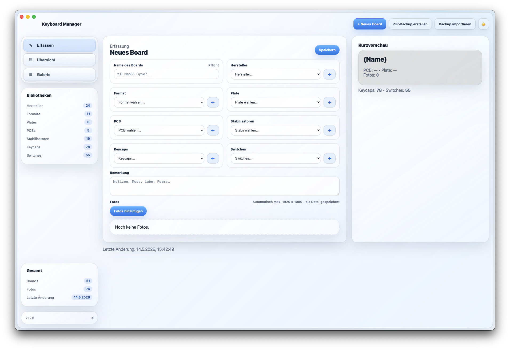
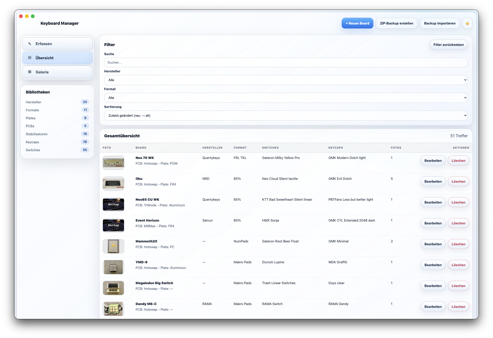
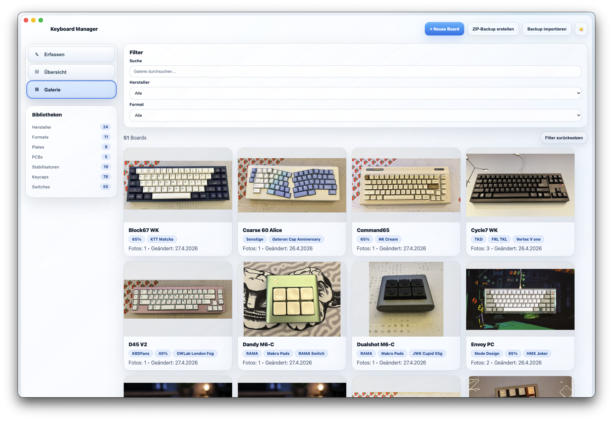
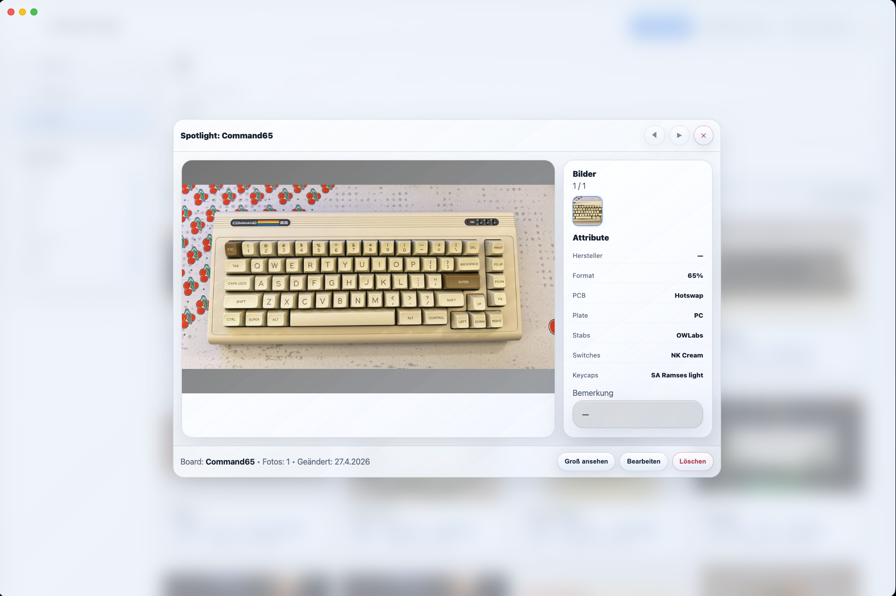

# Keyboard Manager

Desktop-Anwendung zur Verwaltung einer Keyboard-Sammlung mit Boards, Komponenten, Notizen und Fotos.

## Funktionen

- Erfassung, Übersicht und Galerie
- Spotlight und Foto-Großansicht
- SQLite-Datenbank mit verwaltetem Fotoordner
- Automatische Begrenzung importierter Fotos auf maximal 1920 x 1080
- Plattformübergreifende ZIP-Backups mit Manifest und Bilddateien
- Automatische Migration älterer IndexedDB-Daten

## Screenshots

| Erfassung | Übersicht |
| --- | --- |
|  |  |

| Galerie | Spotlight |
| --- | --- |
|  |  |

## Entwicklung

```bash
npm install
npm start
```

## Tests

```bash
npm run test:migration
npm run test:storage
npm run test:close
npm run test:photos
npm run test:export
```

## Builds

```bash
npm run build
npm run build:mac
npm run build:win
```

Windows-Builds werden zusätzlich über GitHub Actions erstellt. Ein Versions-Tag wie `v1.2.8` erzeugt automatisch ein GitHub Release mit ARM-macOS-DMG, Windows-Installer und portabler Windows-App.

Da die Builds nicht signiert sind, können macOS Gatekeeper beziehungsweise Windows SmartScreen beim ersten Start eine Warnung anzeigen.

Der Quellcode und die fertigen Downloads sollen im öffentlichen GitHub-Repository zusammenliegen. Dadurch können Tester die App direkt herunterladen und bei Bedarf den Code, die Build-Konfiguration und die verwendeten Abhängigkeiten prüfen.

### Installation und Updates auf Windows

Der Windows-Installer erkennt eine bestehende Keyboard-Manager-Installation über die unveränderte App-ID und kann sie aktualisieren. Der Installationsassistent bietet die Auswahl zwischen aktuellem Benutzer und allen Benutzern sowie eine wählbare Zielmappe.

Vor einem Update muss Keyboard Manager beendet werden. Die Nutzerdaten liegen unabhängig vom Installationsordner unter `%APPDATA%\Keyboard Manager\`:

- `keyboard-manager.sqlite`: Boards und Einstellungen
- `photos\`: importierte Fotos

Die Deinstallation entfernt diese Nutzerdaten nicht. Vor größeren Updates empfiehlt sich trotzdem ein ZIP-Backup aus der Anwendung.

### Installation auf macOS

Die macOS-App besitzt keine kostenpflichtige Apple-Developer-ID-Signatur. Deshalb blockiert Gatekeeper den ersten Start nach einem Download.

1. App aus dem DMG in den Programme-Ordner ziehen.
2. Im Programme-Ordner mit der rechten Maustaste auf `Keyboard Manager` klicken und `Öffnen` wählen.
3. Falls macOS die App weiterhin blockiert: `Systemeinstellungen` → `Datenschutz & Sicherheit` öffnen und bei Keyboard Manager `Dennoch öffnen` wählen.

Alternativ kann die Download-Quarantäne nach dem Kopieren im Terminal entfernt werden:

```bash
xattr -dr com.apple.quarantine "/Applications/Keyboard Manager.app"
```
